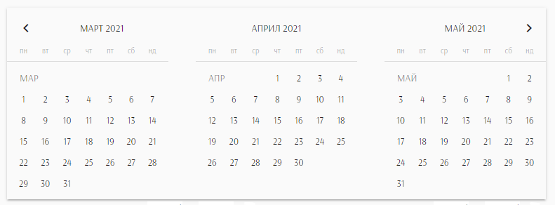

# Angular Material multiple inline calendars

Based on `MatCalendar`, the component under Angular Material Datepicker, this package will help you display and manage multiple inline calendars. Its main purpose is to be used as custom form control in reactive forms.

**Features**
- list multuple months;
- multiple dates selection;
- navigation to next/previous month;



## Versions grid

| Angular | OptimaLib |
| --- | --- |
| 14.x | 14.x |
| 13.x | 13.x |
| 12.x | 0.1.0 |
| 11.x | 0.0.7 |

## Install

```
npm install @optima-lib/inline-calendars
```

## Usage

Import the module to your `app.module.ts`
```
import { OptimaInlineCalendarsModule } from '@optima-lib/inline-calendars';
```

Add the inline calendar components to your view:

```
<optima-inline-calendars></optima-inline-calendars>
```

The following inputs are available at the moment:

* **__totalCalendars__** - number of calendars to be displayed. Default is 3.
* **__startAt__** - The date to be considered as start date. This will be the date on which the calendar in the middle position will be set. Defaults to todays date.
* **__formControlName__** - use this component as custom form control in any reactive form.
